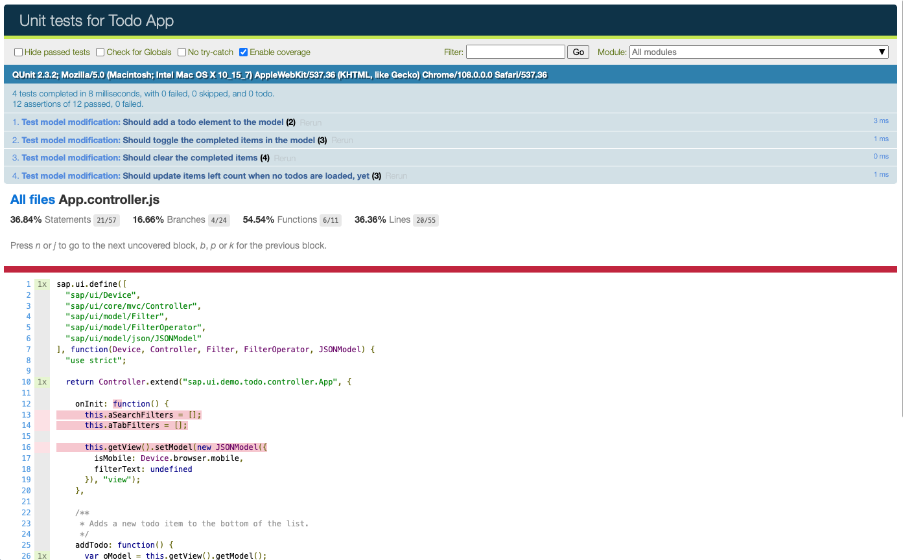

# UI5 Middleware Code Coverage

This UI5 Tooling Server Middleware offers code instrumentation powered by [Istanbul](https://istanbul.js.org/). This makes it easy to enable client-side coverage determination.

[](https://coveralls.io/github/SAP/ui5-tooling-extensions)
[](https://join.slack.com/t/openui5/shared_invite/zt-1q128gn3p-JeZTi9XCpPxW8kBohSgqnw)
[](CODE_OF_CONDUCT.md)
[](https://github.com/SAP/ui5-tooling-extensions/blob/fosstars-report/fosstars_report.md)
[](https://api.reuse.software/info/github.com/SAP/ui5-tooling-extensions)

## Sample

You find this middleware in action in the [OpenUI5 Sample App](https://github.com/SAP/openui5-sample-app).

## Requirements

This middleware requires UI5 Tooling v3 and is meant for UI5 1.113 and above.

## Limitations

Note that this middleware is currently not compatible with TypeScript based projects, see [TypeScript support #189](https://github.com/SAP/ui5-tooling-extensions/issues/189).

## Install

```sh
npm install @ui5/middleware-code-coverage --save-dev
```

## Usage

1. Configure it in `$yourapp/ui5.yaml`:

    The configuration for the custom middleware:

    ```yaml
    server:
      customMiddleware:
      - name: "@ui5/middleware-code-coverage"
        afterMiddleware: compression
        configuration:
          report:
            reporter: ["html"]
            "report-dir": "./tmp/coverage-reports"
            watermarks: {
              statements: [50, 80],
              functions: [50, 80],
              branches: [50, 80],
              lines: [50, 80]
            }
          instrument:
            produceSourceMap: true
            coverageGlobalScope: "window.top"
            coverageGlobalScopeFunc: false
          cwd: "./"
          excludePatterns:
          - "lib/"
          - "another/dir/in/webapp"
          - "yet/another/dir"
    ```

2. Change the qunit coverage module `qunit-coverage.js` to `qunit-coverage-istanbul.js` in your test html files

    **Old:**

    ```html title="unitTests.qunit.html"
    <!DOCTYPE html>
    <html>
    <head>
        <meta charset="utf-8">
        <title>Unit tests for OpenUI5 App</title>

        <script id="sap-ui-bootstrap" src="../../resources/sap-ui-core.js"
          data-sap-ui-theme="sap_horizon"
          data-sap-ui-resourceroots='{
            "ui5.sample": "../../"
          }' data-sap-ui-language="EN" data-sap-ui-async="true">
        </script>

        <link rel="stylesheet" type="text/css" href="../../resources/sap/ui/thirdparty/qunit-2.css">

        <script src="../../resources/sap/ui/thirdparty/qunit-2.js"></script>
        <script src="../../resources/sap/ui/qunit/qunit-junit.js"></script>
        <script src="../../resources/sap/ui/qunit/qunit-coverage.js"
          data-sap-ui-cover-only="ui5/sample/"
          data-sap-ui-cover-never="ui5/sample/test/"></script>
        <script src="../../resources/sap/ui/thirdparty/sinon.js"></script>
        <script src="../../resources/sap/ui/thirdparty/sinon-qunit.js"></script>

        <script src="unitTests.qunit.js"></script>
    </head>
    <body>
        <div id="qunit"></div>
        <div id="qunit-fixture"></div>
    </body>
    </html>
    ```

    **New:**

    ```diff html title="unitTests.qunit.html"
    <!DOCTYPE html>
    <html>
    <head>
        <meta charset="utf-8">
        <title>Unit tests for OpenUI5 App</title>

        <script id="sap-ui-bootstrap" src="../../resources/sap-ui-core.js"
          data-sap-ui-theme="sap_horizon"
          data-sap-ui-resourceroots='{
            "ui5.sample": "../../"
          }' data-sap-ui-language="EN" data-sap-ui-async="true">
        </script>

        <link rel="stylesheet" type="text/css" href="../../resources/sap/ui/thirdparty/qunit-2.css">

        <script src="../../resources/sap/ui/thirdparty/qunit-2.js"></script>
        <script src="../../resources/sap/ui/qunit/qunit-junit.js"></script>
    -   <script src="../../resources/sap/ui/qunit/qunit-coverage.js"
    +   <script src="../../resources/sap/ui/qunit/qunit-coverage-istanbul.js"
          data-sap-ui-cover-only="ui5/sample/"
          data-sap-ui-cover-never="ui5/sample/test/"></script>
        <script src="../../resources/sap/ui/thirdparty/sinon.js"></script>
        <script src="../../resources/sap/ui/thirdparty/sinon-qunit.js"></script>

        <script src="unitTests.qunit.js"></script>
    </head>
    <body>
        <div id="qunit"></div>
        <div id="qunit-fixture"></div>
    </body>
    </html>
    ```

3. Execute `ui5 serve` in the project root folder

4. Open "http://localhost:8080/test/unit/unitTests.qunit.html?coverage" in a browser of your choice

5. Check the code coverage
  

### Configuration

`cwd` [String]: Root folder. Defaults to `"./"` of the project consuming the middleware.

`excludePatterns` [Array]: Patterns to exclude from instrumenting. Defaults to `[]`.

`report` [Object]: Settings for the reporter.

`report.reporter` [Array]: The report type(s) that would be generated. A list of all the available reports could be found [here](https://github.com/istanbuljs/istanbuljs/tree/master/packages/istanbul-reports/lib). Defaults to `["html"]`.

`report["report-dir"]` [String]: Where the reports would be generated. Relative to `cwd`. Defaults to `"./tmp/coverage-reports"`.

`report.watermarks` [Object]: Coverage thresholds. See [High and Low Watermarks](https://github.com/istanbuljs/nyc/blob/ab7c53b2f340b458789a746dff2abd3e2e4790c3/README.md#high-and-low-watermarks) for further details.

Defaults to:

```js
{
    statements: [50, 80],
    functions: [50, 80],
    branches: [50, 80],
    lines: [50, 80]
}
```

`instrument` [Object]: Settings for the instrumenter. A full set of properties could be seen [here](https://github.com/istanbuljs/istanbuljs/blob/master/packages/istanbul-lib-instrument/src/instrumenter.js#L15).

Defaults to:

```js
{
    produceSourceMap: true,
    coverageGlobalScope: "window.top",
    coverageGlobalScopeFunc: false
}
```

### Front-End Configuration

You can override [`watermarks`](https://github.com/istanbuljs/nyc/blob/ab7c53b2f340b458789a746dff2abd3e2e4790c3/README.md#high-and-low-watermarks) (since UI5 1.119.0) via data attributes in the script tag for `qunit-coverage-istanbul.js`':

```diff html title="unitTests.qunit.html"
...

    <script src="../../resources/sap/ui/qunit/qunit-coverage-istanbul.js"
      data-sap-ui-cover-only="ui5/sample/"
      data-sap-ui-cover-never="ui5/sample/test/"
+     data-sap-ui-cover-watermarks-statements="[90,95]"
+     data-sap-ui-cover-watermarks-functions="[90,95]"
+     data-sap-ui-cover-watermarks-branches="[90,95]"
+     data-sap-ui-cover-watermarks-lines="[90,95]"></script>

...
```

## How It Works

The middleware adds an HTTP endpoint to the development server. For more information about the endpoints, see the [API document](./docs/API.md).

The custom middleware intercepts every `.js`-file before it is sent to the client. The file is then instrumented on the fly, which includes the dynamic creation of a `sourcemap`.

The instrumented code and the `sourcemap` are subsequently delivered to the client instead of the original `.js`-file.

## Integration

The middleware is integrated into OpenUI5 out of the box, but you are not limited by this. With the [configuration](#configuration) and the [public API](./docs/API.md), you can set up the middleware to suit your projects' needs.

### OpenUI5 QUnit Integration

The `qunit-coverage-istanbul.js` (part of `sap.ui.core` library) file requests the instrumented source files by the middleware. While the tests are running, `qunit-coverage-istanbul.js` takes care of collecting and storing the coverage records into the `window.__coverage__` global variable. After the tests are executed, `qunit-coverage-istanbul.js` sends this data to the middleware, which then generates the code coverage report. Afterwards, the code coverage is displayed on the test page.


## Code of Conduct

Please check our [Code of Conduct](https://github.com/SAP/ui5-tooling-extensions/blob/main/CODE_OF_CONDUCT.md).

## Contributing

Please check our [Contribution Guidelines](https://github.com/SAP/ui5-tooling-extensions/blob/main/CONTRIBUTING.md).

## Support

Please follow our [Contribution Guidelines](https://github.com/SAP/ui5-tooling-extensions/blob/main/CONTRIBUTING.md#report-an-issue) on how to report an issue. Or chat with us in the [`#tooling`](https://openui5.slack.com/archives/C0A7QFN6B) channel of the [OpenUI5 Community Slack](https://join.slack.com/t/openui5/shared_invite/zt-1q128gn3p-JeZTi9XCpPxW8kBohSgqnw). For public Q&A, use the [`ui5-tooling` tag on Stack Overflow](https://stackoverflow.com/questions/tagged/ui5-tooling).

## Licensing

Copyright 2023 SAP SE or an SAP affiliate company and UI5 Tooling Extensions contributors. Please see our [LICENSE.txt](../../LICENSE.txt) for copyright and license information. Detailed information including third-party components and their licensing/copyright information is available via the [REUSE tool](https://api.reuse.software/info/github.com/SAP/ui5-tooling-extensions).
